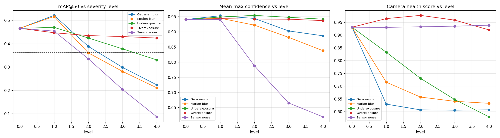
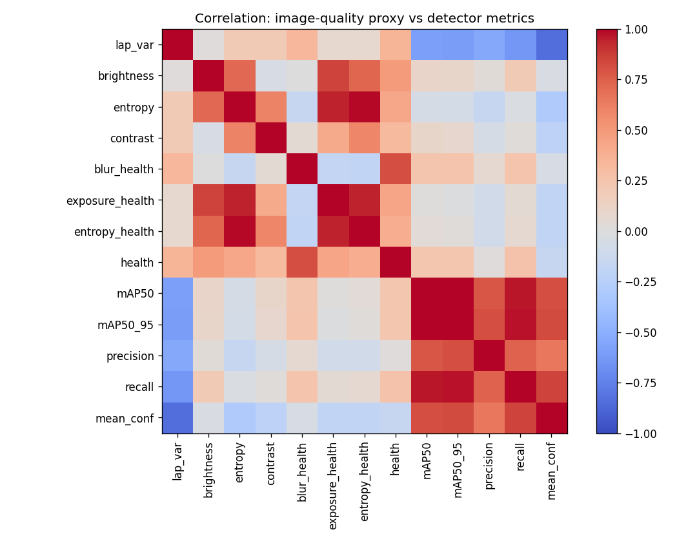
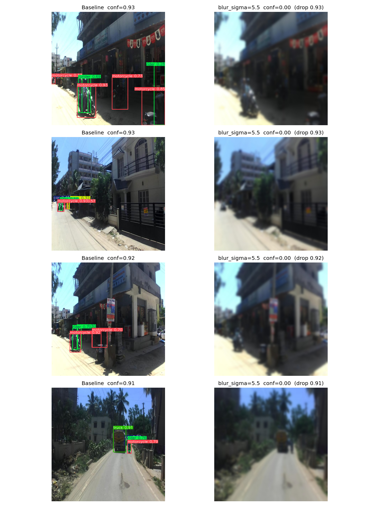

# Báo cáo — Camera Degradation Health Score cho ADAS

**Nhóm:** K4-Track4-Day04-Team10 — Sensor Reality Sprint
**Thời lượng:** 120 phút làm việc + 3–5 phút trình bày
**Trạng thái:** Đã chạy benchmark (kết quả trong `figure/`)

---

## 1. Tóm tắt

Nhóm kiểm tra giả thuyết: chất lượng ảnh camera suy giảm (nhòe, lệch phơi sáng, nhiễu) làm detector ADAS
giảm độ chính xác, và các proxy metric không cần nhãn (`lap_var`, `brightness`, `entropy`, `health`) có
tương quan với mức suy giảm. Trên bộ val Roboflow `adas-oxrvp` (15 class) với `yolov8n`, **baseline identity
trên 200 ảnh val đạt mAP@50 = 0.466**.

Kết quả chính:

- **Sensor noise là nguy hiểm nhất**: sigma 35 làm mAP@50 rơi còn **0.086 (−81.5%)**, số box/ảnh 4.37 → 0.24.
- **Blur cũng rất mạnh**: Gaussian blur sigma 5.5 → **0.223 (−52.1%)**; motion blur kernel 15 → **0.211 (−54.8%)**.
- **Underexposure trung bình** (−29.1% ở gamma 3.2 khi 49.9% pixel bị đen), **overexposure yếu nhất** (−9.0%).
- **Confidence không đáng tin cho blur**: khi mAP giảm 52%, mean confidence vẫn ~0.89 (detector vẫn "tự tin"
  nhưng sai). Với noise thì confidence sụp (0.94 → 0.62).
- **`mean_boxes` là chỉ báo detector tốt nhất** (r = 0.95 với mAP@50), mạnh hơn cả proxy ảnh.
- **Laplacian variance bị noise đánh lừa**: `lap_var` giảm khi blur nhưng **tăng vọt** khi nhiễu
  (616 → 9475 ở sigma 35), nên một "blur score" thô không dùng được làm health score chung.

---

## 2. Bài toán, tính năng và sensor

| Mục | Nội dung |
|---|---|
| Nền tảng | Xe ADAS |
| Tính năng chịu ảnh hưởng | Object detection (YOLO) — nhận diện 15 lớp giao thông (`car`, `person`, `truck`, `traffic light`, `traffic sign`, `bus`, `motorcycle`, `rider`, ...) |
| Sensor | Camera RGB |
| Dataset | Roboflow `guna-tmuht/adas-oxrvp` v1 (15 class) |
| Model | `yolov8n` |
| Input | Ảnh RGB, `imgsz = 640` |
| Số ảnh mỗi lần eval | 200 ảnh đầu của split `valid` (`MAX_VAL_IMAGES = 200`) |
| Baseline (so sánh) | Mức identity (level 0) trên đúng 200 ảnh đó — mAP@50 = **0.466** |

---

## 3. Claim ban đầu

> Khi ảnh bị nhòe mạnh hơn (sigma tăng) hoặc phơi sáng lệch khỏi mức chuẩn, `lap_var` giảm,
> `brightness` lệch khỏi 0.5, `entropy` giảm; và `mAP@50` cùng mean confidence của detector giảm theo
> mức suy giảm.

**Kết luận đối chiếu nhanh:**

| Dự đoán | Kết quả | Đúng? |
|---|---|---|
| Blur ↑ → `lap_var` ↓, `mAP@50` ↓ | lap_var 616 → 2; mAP 0.466 → 0.223 | ✅ |
| Exposure lệch → `mAP@50` ↓ | underexposure −29.1%, overexposure −9.0% | ✅ (nhưng yếu hơn kỳ vọng) |
| Noise ↑ → confidence ↓ | conf 0.94 → 0.62; mAP 0.466 → 0.086 | ✅ |
| Blur ↑ → confidence ↓ | conf chỉ 0.94 → 0.89 dù mAP giảm 52% | ❌ (confidence bền giả tạo) |
| Proxy `health` tổng hợp tương quan mAP | r = 0.24 (yếu) | ❌ (proxy tổng hợp bị pha loãng) |

---

## 4. Thiết kế thí nghiệm

- **Baseline:** ảnh val gốc, đi qua hàm identity (level 0) → **đúng cùng 200 ảnh** dùng cho mọi mức lỗi.
- **Degraded:** cùng 200 ảnh đó, áp một degradation ở một mức; **label giữ nguyên**; dùng cùng `model.val()`,
  cùng `imgsz`, ngưỡng conf/iou → chênh lệch quy về chất lượng sensor.
- **Biến độc lập:** họ degradation × mức.
- **Biến phụ thuộc:** metric chất lượng ảnh (proxy) và metric detector.

| Họ degradation | Mức | Đơn vị |
|---|---|---|
| Gaussian blur | 0 / 1.0 / 2.0 / 3.5 / 5.5 | sigma |
| Motion blur | 1 / 3 / 7 / 11 / 15 | kernel |
| Underexposure | 1.0 / 1.4 / 1.9 / 2.5 / 3.2 | gamma (>1 tối đi) |
| Overexposure | 1.0 / 0.8 / 0.65 / 0.5 / 0.4 | gamma (<1 sáng lên) |
| Sensor noise | 0 / 5 / 10 / 20 / 35 | sigma |

> ⚠️ **Lưu ý phương pháp (đã phát hiện khi chạy):** dòng `clean` trong CSV chạy trên **toàn bộ** split valid
> (mAP@50 = 0.362), còn mọi mức degradation chạy trên **200 ảnh đầu** (nên baseline identity = 0.466). Hai con
> số này không so sánh trực tiếp được. Vì vậy **mọi Δ trong báo cáo đều tính so với baseline identity 0.466**
> trên cùng 200 ảnh. Đây cũng là một bài học đo lường: baseline và điều kiện lỗi phải dùng cùng tập ảnh.

---

## 5. Định nghĩa metric & công thức

### 5.1 Proxy chất lượng ảnh (trên grayscale `I`, 0–255)

| Metric | Công thức | Ý nghĩa | Thay thế cho |
|---|---|---|---|
| `lap_var` | `Var(Laplacian(I))` | độ nét | nhãn "ảnh có nét" |
| `brightness` | `mean(I)/255` | mức phơi sáng | đo sáng thực địa |
| `contrast` | `std(I)/255` | tương phản | điều kiện sáng |
| `clip_low`/`clip_high` | tỉ lệ pixel `≤5` / `≥250` | vùng cháy/đen mất chi tiết | pixel không dùng được |
| `entropy` | `−Σ p·log2(p)` histogram 256 bin | lượng thông tin | độ phong phú chi tiết |
| `health` | trung bình 3 sub-score dưới | sức khoẻ camera (0–1) | cảnh báo tổng hợp |

```
blur_health     = min(1, lap_var / ref.lap_var)
exposure_health = max(0, exp(-((brightness - 0.5)/0.30)^2) * (1 - clip_low - clip_high))
entropy_health  = min(1, entropy / ref.entropy)
health          = (blur_health + exposure_health + entropy_health) / 3
```

> Đây là **heuristic proxy** vì chưa có nhãn "chất lượng ảnh" thủ công. Giá trị baseline: `lap_var` = 615.5,
> `entropy` = 7.44, `brightness` = 0.375, `health` = 0.931.

### 5.2 Metric detector

`mAP@50`, `mAP@50-95`, `precision`, `recall` lấy từ `ultralytics.model.val()`. `mean_conf` = trung bình
`max(confidence)` mỗi ảnh; `mean_boxes` = số box trung bình/ảnh.

---

## 6. Kết quả

### 6.1 Baseline

| Điều kiện | Tập ảnh | mAP@50 | mAP@50-95 | precision | recall | mean_conf | mean_boxes | health |
|---|---|---|---|---|---|---|---|---|
| Clean (toàn bộ valid) | full | 0.362 | 0.234 | 0.553 | 0.346 | 0.941 | 4.36 | 0.931 |
| **Identity (baseline dùng để so)** | 200 ảnh | **0.466** | 0.320 | 0.826 | 0.414 | 0.941 | 4.37 | 0.931 |

> Chất lượng ảnh giữa hai dòng gần như y hệt (health 0.931) — chênh mAP đến từ **số ảnh**, không phải từ ảnh.

### 6.2 Bảng đầy đủ (Δ so với baseline identity 0.466)

| Degradation | Mức | mAP@50 | Δ mAP@50 | mAP@50-95 | precision | recall | mean_conf | mean_boxes | `lap_var` | `brightness` | `entropy` | `health` |
|---|---|---|---|---|---|---|---|---|---|---|---|---|
| Gaussian blur | 0 | 0.466 | — | 0.320 | 0.826 | 0.414 | 0.941 | 4.37 | 616.0 | 0.375 | 7.44 | 0.931 |
| Gaussian blur | 1.0 | 0.521 | **+0.055** | 0.342 | 0.881 | 0.394 | 0.953 | 4.17 | 55.1 | 0.375 | 7.45 | 0.629 |
| Gaussian blur | 2.0 | 0.388 | −0.078 | 0.267 | 0.831 | 0.352 | 0.944 | 4.06 | 9.4 | 0.375 | 7.46 | 0.607 |
| Gaussian blur | 3.5 | 0.298 | −0.168 | 0.203 | 0.683 | 0.295 | 0.903 | 3.15 | 3.1 | 0.375 | 7.46 | 0.606 |
| Gaussian blur | 5.5 | 0.223 | **−0.243** | 0.151 | 0.624 | 0.205 | 0.887 | 1.72 | 2.0 | 0.375 | 7.46 | 0.607 |
| Motion blur | 1 | 0.466 | — | 0.320 | 0.826 | 0.414 | 0.941 | 4.37 | 616.0 | 0.375 | 7.44 | 0.931 |
| Motion blur | 3 | 0.516 | +0.051 | 0.336 | 0.820 | 0.430 | 0.945 | 4.24 | 215.7 | 0.375 | 7.45 | 0.715 |
| Motion blur | 7 | 0.361 | −0.105 | 0.254 | 0.749 | 0.371 | 0.922 | 3.59 | 105.1 | 0.375 | 7.46 | 0.657 |
| Motion blur | 11 | 0.281 | −0.185 | 0.197 | 0.695 | 0.277 | 0.882 | 2.75 | 72.1 | 0.375 | 7.46 | 0.640 |
| Motion blur | 15 | 0.211 | **−0.255** | 0.145 | 0.808 | 0.191 | 0.838 | 2.13 | 55.8 | 0.375 | 7.47 | 0.632 |
| Underexposure | 1.0 | 0.466 | — | 0.320 | 0.826 | 0.414 | 0.941 | 4.37 | 616.0 | 0.375 | 7.44 | 0.931 |
| Underexposure | 1.4 | 0.470 | +0.004 | 0.322 | 0.835 | 0.407 | 0.949 | 4.37 | 611.9 | 0.292 | 7.15 | 0.833 |
| Underexposure | 1.9 | 0.424 | −0.042 | 0.293 | 0.803 | 0.413 | 0.954 | 4.16 | 594.9 | 0.229 | 6.66 | 0.730 |
| Underexposure | 2.5 | 0.378 | −0.088 | 0.261 | 0.810 | 0.315 | 0.948 | 3.71 | 571.9 | 0.182 | 6.04 | 0.647 |
| Underexposure | 3.2 | 0.330 | **−0.136** | 0.226 | 0.764 | 0.288 | 0.942 | 3.36 | 550.4 | 0.147 | 5.37 | 0.579 |
| Overexposure | 1.0 | 0.466 | — | 0.320 | 0.826 | 0.414 | 0.941 | 4.37 | 616.0 | 0.375 | 7.44 | 0.931 |
| Overexposure | 0.8 | 0.447 | −0.019 | 0.308 | 0.839 | 0.410 | 0.943 | 4.34 | 608.3 | 0.432 | 7.51 | 0.965 |
| Overexposure | 0.65 | 0.435 | −0.031 | 0.298 | 0.822 | 0.413 | 0.942 | 4.30 | 597.6 | 0.488 | 7.52 | 0.977 |
| Overexposure | 0.5 | 0.430 | −0.035 | 0.293 | 0.814 | 0.424 | 0.942 | 4.28 | 582.4 | 0.558 | 7.46 | 0.959 |
| Overexposure | 0.4 | 0.424 | **−0.042** | 0.290 | 0.794 | 0.415 | 0.937 | 4.18 | 578.9 | 0.615 | 7.35 | 0.920 |
| Sensor noise | 0 | 0.466 | — | 0.320 | 0.826 | 0.414 | 0.941 | 4.37 | 616.0 | 0.375 | 7.44 | 0.931 |
| Sensor noise | 5 | 0.454 | −0.012 | 0.311 | 0.807 | 0.390 | 0.941 | 3.84 | 875.2 | 0.374 | 7.51 | 0.930 |
| Sensor noise | 10 | 0.335 | −0.131 | 0.231 | 0.727 | 0.300 | 0.788 | 3.05 | 1564.9 | 0.374 | 7.56 | 0.932 |
| Sensor noise | 20 | 0.203 | −0.262 | 0.128 | 0.635 | 0.172 | 0.665 | 1.00 | 3866.1 | 0.375 | 7.65 | 0.935 |
| Sensor noise | 35 | 0.086 | **−0.380** | 0.056 | 0.555 | 0.067 | 0.619 | 0.24 | 9475.4 | 0.379 | 7.74 | 0.939 |

### 6.3 Đường cong suy giảm



- mAP@50 giảm **phi tuyến**: mức nhỏ (blur sigma 1, motion kernel 3) còn **tăng nhẹ** so với baseline
  (+0.05) — nằm trong nhiễu đo và có thể do làm mượt nhẹ ảnh; vượt ngưỡng mới sụp mạnh.
- `mean_conf` gần như phẳng với blur/exposure nhưng sụp với noise → confidence **không phải** chỉ báo
  chung cho mọi lỗi.
- `health` bão hoà ~0.60–0.63 với blur (vì `entropy_health` luôn = 1.0), chỉ giảm rõ với underexposure
  (0.58) → proxy tổng hợp bị pha loãng bởi entropy.

### 6.4 Tương quan proxy ↔ detector



**Overall (bỏ dòng `clean` trùng):**

| Cặp metric | Pearson r | Nhận xét |
|---|---|---|
| `mean_boxes` ↔ `mAP50` | **0.953** | chỉ báo detector tốt nhất (nhưng là output model) |
| `mean_conf` ↔ `mAP50` | **0.818** | tốt, nhưng bị phóng đại bởi noise |
| `lap_var` ↔ `mAP50` | −0.594 | **nghịch dấu** toàn cục: giảm khi blur, tăng khi noise |
| `health` ↔ `mAP50` | 0.237 | yếu toàn cục |
| `brightness` ↔ `mAP50` | 0.103 | yếu |
| `entropy` ↔ `mAP50` | −0.054 | gần như không tương quan |

**Theo từng họ (r với mAP@50):**

| Họ | `lap_var` | `mean_conf` | `mean_boxes` | `health` |
|---|---|---|---|---|
| Gaussian blur | 0.466 | 0.947 | 0.907 | 0.452 |
| Motion blur | 0.656 | 0.955 | 0.973 | 0.650 |
| Underexposure | 0.997 | 0.182 | 0.994 | 0.945 |
| Overexposure | 0.938 | 0.360 | 0.877 | −0.094 |
| Sensor noise | **−0.932** | 0.984 | 0.988 | **−0.985** |

→ Kết luận: proxy ảnh chỉ đáng tin **khi biết họ lỗi**. `lap_var` tốt cho blur/exposure nhưng bị đảo
dấu hoàn toàn với noise. `health` tổng hợp tốt cho underexposure (0.945) nhưng **ngược dấu với noise**
(−0.985) vì noise làm tăng entropy và lap_var.

---

## 7. Failure case

**Ảnh tiêu biểu:** `figure/failure_cases.png` — cùng một ảnh, baseline vs Gaussian blur sigma 5.5,
có vẽ box + confidence (top 4 ca tụt confidence mạnh nhất).



Cơ chế thất bại:

- Blur sigma 5.5: số box/ảnh giảm 4.37 → 1.72, mAP@50 0.466 → 0.223 (−52%) nhưng confidence trung bình
  vẫn 0.887 → **detector mất vật thể nhưng vẫn tự tin ở những box còn lại**.
- Noise sigma 20: số box/ảnh 4.37 → 1.00; sigma 35: còn 0.24 box/ảnh và mAP@50 0.086 → gần như mù hoàn toàn.
- Underexposure gamma 3.2: 49.9% pixel bị kẹp về đen (`clip_low` = 0.499) → mất chi tiết vùng tối.

| # | Điều kiện | Conf baseline | Conf degraded | Số box | Ghi chú |
|---|---|---|---|---|---|
| — | Blur sigma 5.5 | 0.941 (mean) | 0.887 (mean) | 4.37 → 1.72 | confidence bền giả tạo, mất nhiều box |
| — | Noise sigma 35 | 0.941 (mean) | 0.619 (mean) | 4.37 → 0.24 | detector gần như mù |

> Ảnh `failure_cases.png` chọn top 4 ảnh có mức tụt `max(confidence)` lớn nhất khi blur sigma = 5.5.

---

## 8. Thảo luận trade-off

- **Vì sao noise lại hại nhất (mAP −81%)?** Nhiễu phá cấu trúc tần số cao ở toàn ảnh, trong khi vật thể
  ADAS (xe, người, biển báo) vừa nhỏ vừa ở xa → tín hiệu dễ chìm dưới nhiễu. Ngược lại overexposure chỉ
  đẩy độ sáng mà không phá cấu trúc nên chỉ −9%.
- **Vì sao confidence "bền" với blur nhưng sụp với noise?** Blur giữ nguyên vùng sáng cấu trúc và làm mượt
  → model vẫn tạo được đáp ứng mạnh ở vài vật thể lớn; noise làm phân bố pixel lệch khỏi phân bố train →
  logits yếu đi. Hệ quả: **không thể dùng confidence đơn thuần để tự chẩn đoán blur**.
- **Proxy nào là cảnh báo sớm tốt nhất?** `mean_boxes` (r = 0.95) và `mean_conf` (r = 0.82) — nhưng đây là
  output của detector, chưa phải "cảm biến" độc lập. Trong nhóm proxy ảnh, `lap_var` chỉ dùng được khi
  lọc đúng họ lỗi (blur/exposure), còn `health` tổng hợp hiện **thất bại với noise**.
- **Đánh đổi:** proxy đo được ngay, rẻ, không cần nhãn, nhưng tương quan với mAP **phụ thuộc loại lỗi**.
  Một ngưỡng cảnh báo chung rất dễ báo sai (noise làm health *tăng* trong khi mAP sụp).

---

## 9. Đề xuất cải tiến

1. **Sửa health score:** bỏ `entropy_health` khỏi trung bình (nó luôn ~1.0 và làm loãng tín hiệu blur);
   dùng trọng số theo họ lỗi, và thêm **feature học được** (no-reference IQA) thay vì heuristic.
2. **Augmentation khi train** đúng các mức đã benchmark: blur sigma ≤ 3.5, motion kernel ≤ 11,
   noise sigma ≤ 10, gamma 1.4–2.5. Benchmark lại để đo mAP giảm bao nhiêu (mục tiêu: kéo noise sigma 20
   từ 0.203 lên gần baseline).
3. **Health-aware fallback:** khi `mean_boxes`/`health` vượt ngưỡng cảnh báo → giảm tốc, tăng cảnh báo,
   hoặc chuyển sensor (LiDAR/radar) để tránh mù do camera.
4. **Ngưỡng confidence động** theo health để bù recall (0.171 ở noise sigma 20).
5. **Kiểm chứng ngoài phân bố:** dùng dữ liệu lỗi thật (ACDC, DAWN) để so với degradation tổng hợp.

---

## 10. Hạn chế

- Degradation là **tổng hợp**, chưa chắc khớp lỗi sensor thật (rolling shutter, glare, mưa/thấm nước).
- Chỉ **200 ảnh val**; chưa tính confidence interval cho mAP → các Δ nhỏ (ví dụ +0.05 ở mức blur 1)
  có thể nằm trong nhiễu.
- Baseline notebook có **hai tập ảnh** (full vs 200) gây nhầm lẫn ban đầu; báo cáo đã chuẩn hoá về 200 ảnh.
- Proxy chất lượng là heuristic, chưa có nhãn người gán.
- Model `yolov8n` nhỏ; kết luận có thể khác với model lớn hơn.

---

## 11. Bằng chứng đã chạy

| Artifact | Đường dẫn | Trạng thái |
|---|---|---|
| Notebook | `notebooks/camera_degradation_benchmark.ipynb` | ✅ đã chạy |
| Bảng số liệu | `figure/degradation_results.csv` | ✅ |
| Đường cong suy giảm | `figure/curves.png` | ✅ |
| Ma trận tương quan | `figure/correlation.png` | ✅ |
| Failure case | `figure/failure_cases.png` | ✅ |

---

## 12. Phân công & đóng góp

| Thành viên | Việc đã làm | Bằng chứng |
|---|---|---|
| [Tên 1] | Tìm dataset/paper, chốt claim & scope | Mục 3, 8 |
| [Tên 2] | Code degradation + build degraded set | Cell 4, 6 notebook |
| [Tên 3] | Train / load weights baseline | `best.pt`, log train |
| [Tên 4] | Chạy benchmark, metric, plot | `figure/degradation_results.csv`, `curves.png`, `correlation.png` |
| [Tên 5] | Failure case + báo cáo/slide | `failure_cases.png`, `report.md` |

> Mỗi thành viên nộp một bản riêng trên VLearn.

---

## Phụ lục — Cách lấy số

```python
import pandas as pd
df = pd.read_csv("figure/degradation_results.csv")

# baseline identity trên 200 ảnh
B = df[(df.degradation == "blur_sigma") & (df.level == 0)]["mAP50"].iloc[0]
print("baseline mAP50 =", round(B, 4))

# mức cuối mỗi họ + % giảm
last = df[df.level == df.level.max()]
print(last[["degradation", "value", "mAP50", "mean_conf", "mean_boxes", "health"]])

# tương quan toàn cục (bỏ dòng clean trùng)
d = df[df.degradation != "clean"]
print(d[["lap_var", "brightness", "entropy", "health", "mean_conf", "mean_boxes", "mAP50"]].corr()["mAP50"])
```
