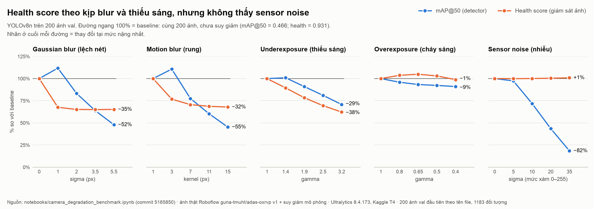
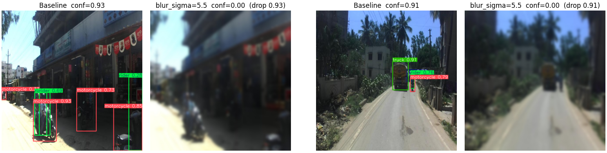

# Camera suy giảm và detector ADAS: health score báo trước được tới đâu?

**Nhóm 10 · K4 Track4 Day04 Sensor Reality Sprint · Bước 6** · Người viết: Đoàn Duy Bách (MSSV 2A202602515) · 05/10/2026

> Ký hiệu: **[Paper]** = kết luận của paper/repo nguồn · **[Nhóm đo]** = kết quả nhóm tự chạy trong notebook.

## 1. Problem

- **Nền tảng:** ô tô có ADAS, một camera RGB nhìn phía trước.
- **Tính năng:** phát hiện vật thể 15 lớp (xe, xe máy, người, người lái, biển báo, đèn…) làm đầu vào cho cảnh báo va chạm phía trước.
- **Sensor và failure thực tế:** ống kính bẩn, ướt hoặc lệch nét → nhòe; xe rung khi màn trập chậm → motion blur; vào hầm, ban đêm → thiếu sáng; nắng gắt, đèn pha → cháy sáng; ISO cao khi thiếu sáng → nhiễu.
- **Rủi ro:** detector bỏ sót vật thể mà không báo lỗi, nên tính năng cảnh báo im lặng đúng lúc cần.
- **Câu hỏi:** detector tụt bao nhiêu với từng loại lỗi, và một health score tính từ chính ảnh có báo trước được không?

## 2. Method

| Thành phần | Nội dung |
|---|---|
| Detector | YOLOv8n (repo Ultralytics 8.4.173), nhóm train trên dataset bên dưới. **Input:** ảnh RGB 640×640. **Output:** box, lớp (15), confidence. |
| Cách đo | Theo Michaelis et al. 2019: giữ nguyên ảnh và nhãn, chỉ làm hỏng ảnh. 5 loại lỗi × 4 mức, cộng mức 0 là ảnh gốc. |
| Health score (0..1) | Trung bình 3 điểm trên ảnh xám. **Độ nét:** variance of Laplacian chia giá trị ở ảnh sạch, chặn ở 1 (Pech-Pacheco et al. 2000). **Phơi sáng:** exp(−((brightness − 0.5)/0.3)²) × (1 − tỉ lệ pixel ≤ 5 hoặc ≥ 250). **Entropy:** chia giá trị ở ảnh sạch, chặn ở 1. Chỉ cần OpenCV, không cần GPU. |
| Giả định | Lỗi mô phỏng đều trên toàn ảnh xấp xỉ lỗi cảm biến thật; vật thể vẫn còn trong ảnh nên giữ nguyên nhãn; 200 ảnh đầu đủ đại diện. |

**[Paper]** Michaelis et al. 2019: các detector chuẩn chỉ còn 30–60% hiệu năng gốc khi ảnh bị suy giảm; train trên ảnh đã stylize giúp bền hơn đáng kể.

**Truy vết**

- Code và output: [`notebooks/camera_degradation_benchmark.ipynb`](https://github.com/huy20/K4-Track4-Day04-Team10-Sensor-Reality-Sprint/blob/5165850/notebooks/camera_degradation_benchmark.ipynb), commit `5165850`.
- Dataset: Roboflow [`guna-tmuht/adas-oxrvp` v1](https://universe.roboflow.com/guna-tmuht/adas-oxrvp/dataset/1), CC BY 4.0. Train/valid/test: 6927/1980/987 ảnh.
- Model: Kaggle Model `huy1805/yolov8` (PyTorch, v1), file `best (1).pt`. Script train: [`train.py`](../train.py) (fine-tune từ `yolov8n.pt` pretrained COCO, 10 epochs, imgsz 640, batch 16, augmentation mặc định của Ultralytics).
- Môi trường: Kaggle, Tesla T4, Python 3.13.15, torch 2.11.0+cu128, Ultralytics 8.4.173.
- Paper: [Michaelis et al. 2019, arXiv:1907.07484](https://arxiv.org/abs/1907.07484); Pech-Pacheco et al., *Diatom autofocusing in brightfield microscopy: a comparative study*, ICPR 2000.
- Lệnh chạy:
  1. Benchmark (GPU): mở notebook trên Kaggle, bật Internet và GPU T4, Add Input `huy1805/yolov8`. Ở mục 1, điền Roboflow key vào `RF_API_KEY` (hoặc đặt `RF_API_KEY = ""` để đọc Kaggle Secret `ROBOFLOW_API_KEY`), rồi Run All.
  2. Bảng và plot của báo cáo (không cần GPU, đọc output đã lưu trong notebook): `pip install matplotlib && python scripts/make_step6_figures.py`

## 3. Benchmark [Nhóm đo]

- **Dữ liệu:** ảnh camera hành trình thật, lỗi **mô phỏng** bằng OpenCV.
- **Cấu hình:** 200 ảnh valid đầu tiên theo tên file (1183 đối tượng), imgsz 640, batch 16, chạy 1 lần.
- **Baseline:** chính 200 ảnh đó khi chưa suy giảm, mAP@50 = **0.466**. Dòng `Clean` = 0.362 trong notebook đo trên cả 1980 ảnh valid, khác tập ảnh nên không dùng để so sánh.
- **Metric:** mAP@50 là metric chính. Kèm theo: recall; box/ảnh (ngưỡng 0.25); mean conf (trung bình max confidence của các ảnh còn box); health. mAP và recall tính trên 200 ảnh, box/ảnh và mean conf trên 100 ảnh đầu, health trên 150 ảnh đầu.

| Mức nặng nhất mỗi loại | mAP@50 | So với baseline | Recall | Box/ảnh | Mean conf | Health |
|---|---|---|---|---|---|---|
| Baseline (ảnh gốc) | 0.466 | — | 0.414 | 4.37 | 0.941 | 0.931 |
| Gaussian blur, σ = 5.5 px | 0.223 | −52% | 0.205 | 1.72 | 0.887 | 0.607 |
| Motion blur, kernel 15 px | 0.211 | −55% | 0.191 | 2.13 | 0.838 | 0.632 |
| Thiếu sáng, γ = 3.2 | 0.330 | −29% | 0.288 | 3.36 | 0.942 | 0.579 |
| Cháy sáng, γ = 0.4 | 0.424 | −9% | 0.415 | 4.18 | 0.937 | 0.920 |
| Sensor noise, σ = 35 (thang 0–255) | **0.086** | **−82%** | 0.067 | 0.24 | 0.619 | **0.939** |

Đủ 26 dòng: [`results/benchmark_table.csv`](../results/benchmark_table.csv).

- **Claim chỉ đúng một phần.** Với blur, motion blur và thiếu sáng, health giảm cùng mAP. Với noise σ = 35, mAP giảm 82% còn health tăng 1%: nhiễu tạo cạnh giả, variance of Laplacian tăng từ 616 lên 9475, nên health đọc thành ảnh "nét hơn".
- **So với [Paper]:** ở mức nặng nhất, hai loại blur còn 45–48% mAP@50 gốc, khớp khoảng 30–60%; noise còn 18%, tệ hơn; phơi sáng còn 71–91%. Không so trực tiếp được vì khác model, bộ lỗi và thang mức độ.
- **Giới hạn:** tập 200 ảnh không chọn ngẫu nhiên và dễ hơn trung bình (0.466 so với 0.362 trên cả valid); chạy 1 lần, không có khoảng tin cậy. Vì vậy chênh lệch nhỏ, như blur nhẹ làm mAP tăng khoảng 11–12%, chưa đủ để kết luận.

## 4. Failure case: Gaussian blur σ = 5.5 px (ống kính bẩn, ướt hoặc lệch nét)

- **Hiện tượng [Nhóm đo]:** ở 4 khung hình trong notebook (mục 11), max confidence từ 0.91–0.93 rơi về 0.00. Không còn box nào: xe máy, người lái, xe tải đều bị bỏ sót. Trên 200 ảnh, recall giảm từ 0.414 xuống 0.205 và box/ảnh từ 4.37 xuống 1.72. Đủ 4 ví dụ: [`results/failure_case_blur_sigma5p5.png`](../results/failure_case_blur_sigma5p5.png).
- **Nguyên nhân:** blur xóa cạnh và chi tiết nhỏ. Vật nhỏ, mảnh hoặc ở xa như xe máy và người lái mất đặc trưng trước.
- **Ảnh hưởng tới tính năng:** cảnh báo va chạm không nhận được vật thể nên không cảnh báo, và hệ thống không biết mình đang "mù".
- **Vì sao cần monitor từ ảnh:** các box còn sót vẫn có confidence cao (0.887 so với 0.941), nên nhìn confidence không thấy lỗi. Health score thì thấy: giảm từ 0.931 xuống 0.607.

## 5. Engineering decision

**Quyết định:** không dùng health score một mình làm tín hiệu "camera ổn". Bật fallback khi **health < 0.70 HOẶC mean conf < 0.85**.

Thử trên 20 điều kiện lỗi. "Suy giảm" được định nghĩa là mAP@50 tụt quá 20% so với baseline (9 điều kiện). Chi tiết: [`results/fallback_rule_check.csv`](../results/fallback_rule_check.csv).

| Luật cảnh báo | Bắt được (/9 điều kiện suy giảm) | Báo nhầm (/11 điều kiện còn lại) |
|---|---|---|
| health < 0.70 (cải tiến đề xuất ở Bước 5) | 6/9, sót cả 3 mức noise (σ = 10, 20, 35) | 3/11 |
| mean conf < 0.85 | 4/9, sót 2 mức Gaussian blur, 2 mức motion blur, thiếu sáng γ = 3.2 | 0/11 |
| **Kết hợp hai luật** | **9/9** | 3/11: blur σ = 1 và 2, thiếu sáng γ = 2.5 (hai trường hợp sau đã tụt 17–19%) |

Ngưỡng được chọn trên chính 20 điều kiện này nên kết quả còn lạc quan. Khi chạy thật, mean conf phải lấy trung bình trượt theo thời gian.

- **Fallback khi kích hoạt:** báo "camera suy giảm" cho tài xế, hạ mức hỗ trợ của ADAS, dùng radar làm nguồn chính cho phanh khẩn cấp.
- **Log mỗi khung hình:** lap_var, brightness, tỉ lệ pixel quá tối và quá sáng, entropy, health, số box, max confidence. Thêm gain, exposure, ISO từ ISP để nhận ra noise. Thêm thời gian và GPS.
- **Dữ liệu cần tiếp theo:**
  1. Ảnh lỗi thật có nhãn (đêm/ISO cao, mưa, chói, ống kính bẩn), ví dụ BDD100K lọc theo thời tiết và thời điểm trong ngày.
  2. Chạy lại trên 200 ảnh chọn ngẫu nhiên và trên cả 1980 ảnh, có khoảng tin cậy.
  3. Thử đề xuất còn lại của Bước 5: train với augmentation blur + noise, rồi chạy lại đúng benchmark này.
- **Trade-off:**
  - Health score rẻ, chạy được trên CPU, dễ giải thích, hợp làm lớp kiểm tra đầu tiên cho ô tô và robot. Nhưng nó mù với noise, và giá trị tham chiếu (lap_var 616) lấy từ phố đông nhiều chi tiết. Ở đường cao tốc vắng, trong sương mù, hay với drone nhìn lên trời hoặc mặt nước, lap_var thấp một cách tự nhiên nên sẽ báo nhầm; cần hiệu chỉnh theo từng camera.
  - Tín hiệu confidence bắt được noise, nhưng phụ thuộc mật độ vật thể: đường vắng thì ít box là bình thường. Vì vậy cần cửa sổ thời gian và đối chiếu với radar.
